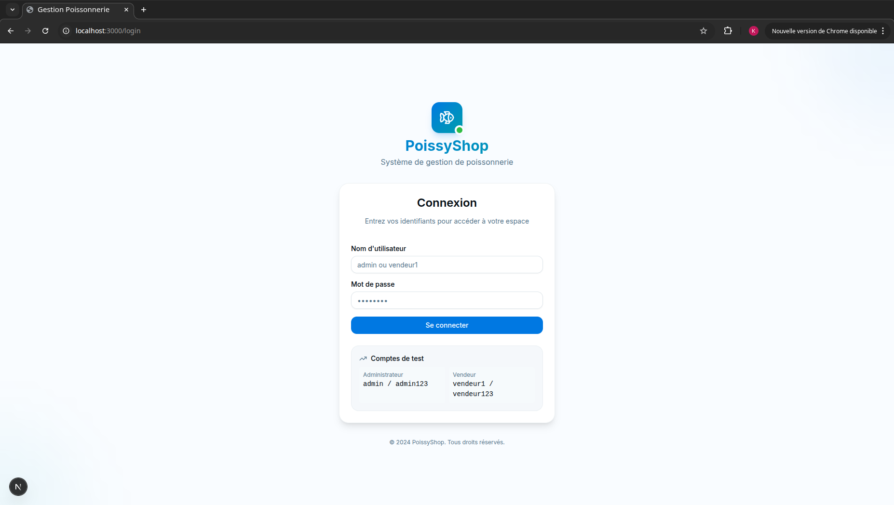
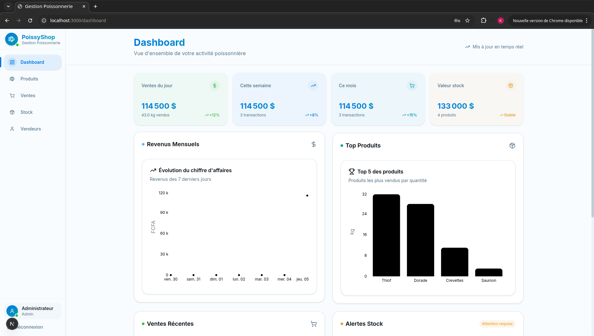
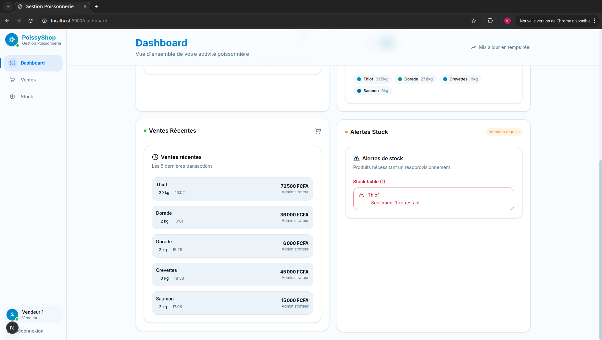
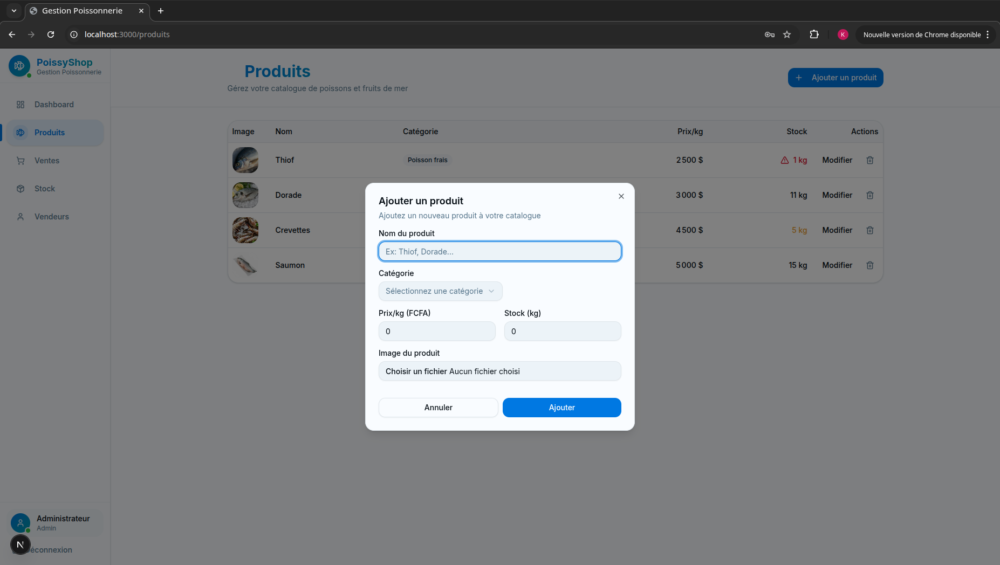
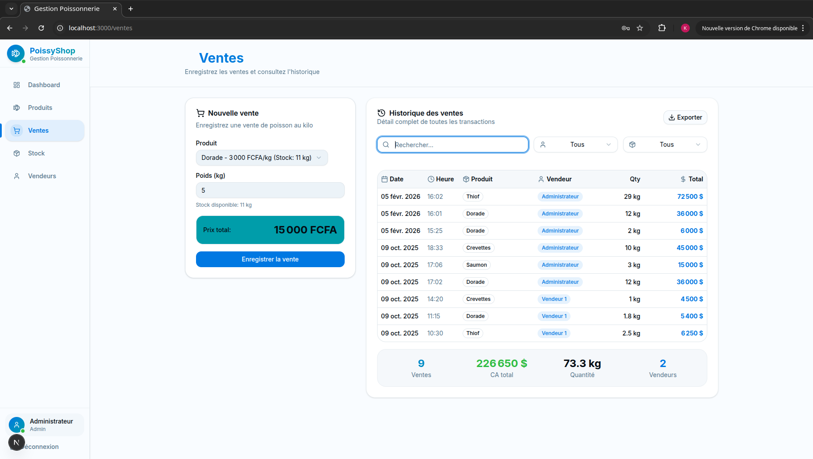
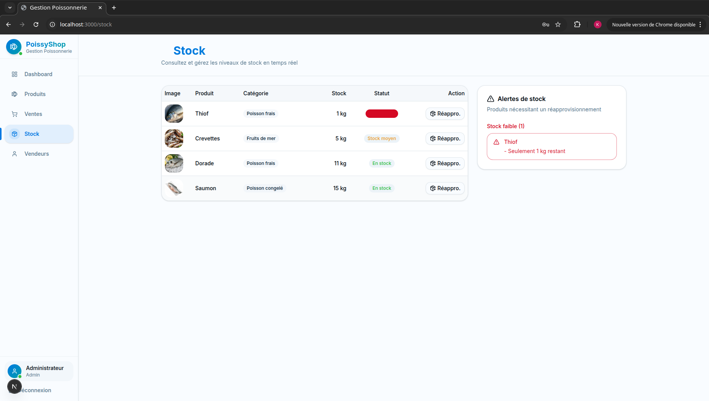
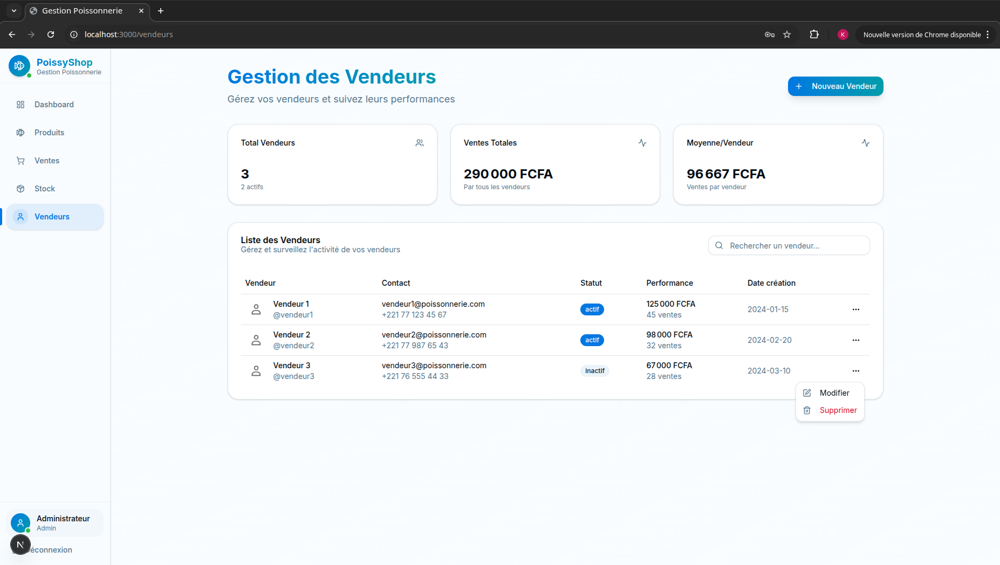

# 🐟 PoissyShop — Application de Gestion de Poissonnerie

> **Application web fullstack pour la gestion opérationnelle d'une poissonnerie** — desarrollada avec Next.js 15, TypeScript et React.

[](https://nextjs.org/)
[](https://www.typescriptlang.org/)
[](https://tailwindcss.com/)
[](https://react.dev/)

---

## 📋 Sommaire

1. [À propos du projet](#à-propos-du-projet)
2. [Stack technique](#stack-technique)
3. [Architecture du projet](#architecture-du-projet)
4. [Fonctionnalités](#fonctionnalités)
5. [Installation et démarrage](#installation-et-démarrage)
6. [Données de test](#données-de-test)
7. [Structure des données](#structure-des-données)
8. [Points forts pour les recruteurs](#points-forts-pour-les-recruteurs)
9. [Captures d'écran recommandées](#-captures-décran-recommandées)
10. [Évolutions futures](#-évolutions-futures)
11. [Licence](#licence)

---

## 🏪 À propos du projet

**PoissyShop** est une application web complète destinée à la gestion quotidienne d'une poissonnerie. Elle permet de gérer l'ensemble des opérations commerciales : catalogue de produits, ventes, stock et vendeurs.

L'application a été conçue avec une approche **modulaire et extensible**, favorisant la maintenabilité du code et l'évolution vers une architecture microservices ou une API REST dédiée.

### 🎯 Objectifs techniques

- **Expérience utilisateur fluide** grâce au rendu serveur (SSR) et au streaming de Next.js 15
- **Typage strict** avec TypeScript pour une base de code robuste et documentée
- **Design system cohérent** basé sur shadcn/ui et Tailwind CSS
- **Architecture scalable** prête pour la production et l'évolution

---

## ⚙️ Stack technique

### Frontend

| Technologie | Rôle |
|-------------|------|
| **Next.js 15** | Framework React avec App Router, Server Components et streaming |
| **TypeScript 5** | Typage statique pour la sécurité et l'autocomplétion |
| **Tailwind CSS 3.4** | Framework CSS utilitaire pour un design responsive rapide |
| **shadcn/ui** | Composants UI accessibles et personnalisables |
| **React 18** | Bibliothèque UI avec Concurrent Features |
| **Zustand** | Gestion d'état légère et performante |
| **React Hook Form** | Gestion et validation des formulaires |
| **date-fns** | Manipulation de dates côté client |
| **Recharts** | Visualisation des données avec graphiques interactifs |
| **Lucide React** | Icônes modernes et cohérentes |

### Backend & API

| Technologie | Rôle |
|-------------|------|
| **Next.js API Routes** | API routes côté serveur (App Router) |
| **Node.js** | Environnement d'exécution |
| **TypeScript** | Typage partagé client/serveur |

### Outils de développement

| Technologie | Rôle |
|-------------|------|
| **ESLint** | Analyse statique du code |
| **PostCSS** | Traitement CSS avancé |
| **Turbopack** | Bundler ultra-rapide pour le développement |

---

## 🏗️ Architecture du projet

```
Poissonnerie/
├── app/                          # Next.js App Router
│   ├── api/                      # API Routes (Backend)
│   │   ├── initial-data/        # Endpoint d'initialisation
│   │   ├── products/            # CRUD Products
│   │   │   └── [id]/           # Route paramétrée
│   │   └── sales/              # Gestion des ventes
│   ├── dashboard/               # Tableau de bord principal
│   ├── login/                   # Authentification
│   ├── produits/               # Gestion du catalogue
│   ├── stock/                  # Suivi du stock
│   ├── vendeurs/               # Gestion des vendeurs
│   └── ventes/                 # Historique des ventes
├── components/
│   ├── ui/                     # Composants base (shadcn/ui)
│   ├── app-sidebar.tsx         # Navigation principale
│   ├── dashboard-stats.tsx     # Widgets statistiques
│   ├── product-form.tsx        # Formulaire CRUD produits
│   ├── product-table.tsx       # Tableau des produits
│   ├── sale-form.tsx          # Création de ventes
│   ├── sales-history.tsx       # Historique complet
│   ├── stock-alerts.tsx       # Alertes stock faible
│   ├── revenue-chart.tsx      # Graphique CA
│   ├── top-products-chart.tsx # Top produits
│   └── protected-route.tsx    # Guard routes
├── lib/
│   ├── auth.tsx               # Gestion auth (RBAC)
│   ├── store.ts               # Store Zustand
│   ├── data-service.ts        # Services de données
│   ├── error-messages.ts      # Messages d'erreur typés
│   └── utils.ts               # Utilitaires
├── hooks/                     # Hooks React personnalisés
├── data/                      # Données mockées
│   └── data.json              # Seed data complète
├── public/                    # Assets statiques
└── styles/
    └── globals.css            # Styles globaux
```

### Patterns architecturaux

- **App Router** : Utilisation des Server Components pour le rendu initial
- **RBAC (Role-Based Access Control)** : Système d'autorisation basé sur les rôles
- **Server Actions** : Mutations de données sécurisées
- **Atomic Design** : Composants réutilisables et composables
- **Singleton Store** : État global avec Zustand Persist

---

## ✨ Fonctionnalités

### 1. Authentication & Autorisation

| Fonctionnalité | Description |
|----------------|-------------|
| **Connexion sécurisée** | Système d'authentification basé sur les sessions |
| **RBAC (Role-Based Access Control)** | Deux rôles : `admin` et `vendeur` |
| **Protection des routes** | Middleware d'autorisation par page |
| **Gestion des tokens** | Persistance sécurisée côté client |

#### Rôles et permissions

| Ressource | Admin | Vendeur |
|-----------|-------|---------|
| Dashboard | ✅ Accès complet | ✅ Stats limitées |
| Produits | ✅ CRUD complet | 📖 Lecture seule |
| Ventes | ✅ CRUD + stats | ✅ Création |
| Stock | ✅ Gestion complète | 📖 Consultation |
| Vendeurs | ✅ CRUD | ❌ Non accessible |

### 2. Dashboard Analytique

```
┌─────────────────────────────────────────────────────────────┐
│  💰 Ventes du jour    📦 Valeur stock    👥 Vendeurs actifs │
│      116 650 F CFA         382 500 F CFA           2        │
├─────────────────────────────────────────────────────────────┤
│  📈 Graphique CA (7 derniers jours)                          │
│  ┌─────────────────────────────────────────┐               │
│  │    ████                                  │               │
│  │    ████  ████                            │               │
│  │    ████  ████  ████                      │               │
│  │    ████  ████  ████  ████                │               │
│  └─────────────────────────────────────────┘               │
├─────────────────────────────────────────────────────────────┤
│  🐠 Top produits        │  🔔 Alertes stock (< 10 units)   │
│  • Thiof (45%)          │  ⚠️ Crevettes: 5 kg              │
│  • Dorade (30%)         │  ⚠️ Saumon: 3 kg                 │
└─────────────────────────────────────────────────────────────┘
```

### 3. Gestion des Produits

- **Catalogue complet** : 5 produits par défaut (Thiof, Dorade, Crevettes, Saumon, Bar)
- **Catégories** : Poisson frais, Fruits de mer, Poisson congelé
- **Suivi des prix** : Prix au kilogramme
- **Images** : Galerie intégrée pour chaque produit
- **Tracking** : Dates de création et modification

### 4. Gestion des Ventes

- **Enregistrement rapide** : Sélection produit + poids = calcul automatique
- **Historique complet** : Traçabilité de chaque transaction
- **Filtrage** : Par date, vendeur, produit
- **Impact stock** : Décrémentation automatique du stock

### 5. Gestion du Stock

- **Suivi temps réel** : Quantités disponibles à jour
- **Alertes intelligentes** : Notification quand stock < seuil
- **Valorisation** : Calcul automatique de la valeur du stock
- **MAJ automatique** : Synchronisation avec les ventes

### 6. Gestion des Vendeurs

- **CRD complet** : Création, lecture, suppression
- **Stats individuelles** : CA généré, nombre de ventes
- **Validation** : Données vérifiées avant insertion

---

## 🚀 Installation et démarrage

### Prérequis

- **Node.js** : Version 18+
- **Package manager** : npm, yarn ou pnpm (préféré)

### Installation

```bash
# Cloner le repository
git clone https://github.com/votre-username/poissonnerie.git
cd poissonnerie

# Installer les dépendances
pnpm install
# ou
npm install
# ou
yarn install

# Démarrer le serveur de développement
pnpm dev
# ou
npm run dev

# Build pour production
pnpm build
# ou
npm run build

# Démarrer en production
pnpm start
# ou
npm start
```

L'application sera accessible sur `http://localhost:3000`

---

## 🧪 Données de test

### Comptes disponibles

| Rôle | Identifiant | Mot de passe |
|------|-------------|--------------|
| **Administrateur** | `admin` | `admin123` |
| **Vendeur** | `vendeur1` | `vendeur123` |

### Données seedées

Le projet inclut un jeu de données complet pour le développement :

- **2 utilisateurs** (1 admin, 1 vendeur)
- **5 produits** représentatifs du secteur
- **6 ventes** historiques

Ces données sont situées dans [`data/data.json`](data/data.json) et peuvent être modifiées selon vos besoins.

---

## 📊 Structure des données

### Modèle de données

```typescript
// Utilisateur
interface User {
  id: number;
  username: string;
  role: 'admin' | 'vendeur';
  nom: string;
  created_at: string;
}

// Produit
interface Product {
  id: number;
  nom: string;
  categorie: 'Poisson frais' | 'Fruits de mer' | 'Poisson congelé';
  prix_kg: number;
  quantite_stock: number;
  image: string;
  created_at: string;
  updated_at: string;
}

// Vente
interface Sale {
  id: number;
  produit_id: number;
  produit_nom: string;
  poids_kg: number;
  prix_total: number;
  date_vente: string;
  vendeur_id: number;
  vendeur_nom: string;
  created_at: string;
}
```

### Relations

```
Users (1) ──────< (N) Sales
Products (1) ──< (N) Sales
```

---

## 💼 Points forts pour les recruteurs

### 🔧 Compétences techniques démontrées

| Domaine | Technologies | Niveau |
|---------|--------------|--------|
| **Frontend** | Next.js 15, React 18, TypeScript | Intermédiaire-avancé |
| **Styling** | Tailwind CSS, shadcn/ui | Intermédiaire |
| **State Management** | Zustand | Intermédiaire |
| **Forms** | React Hook Form, Zod | Intermédiaire |
| **Visualisation** | Recharts | Intermédiaire |
| **Build Tools** | ESLint, PostCSS | Intermédiaire |

### 🧠 Compétences transversales

✅ **Architecture propre** : Découpage logique en dossiers, composants réutilisables

✅ **Typage TypeScript** : Utilisation intensive des types pour la sécurité du code

✅ **Responsive Design** : Interface adaptative mobile/desktop

✅ **Accessibilité** : Composants shadcn/ui accessibles par défaut

✅ **Bonnes pratiques** : Validation des formulaires, gestion d'erreurs

✅ **Documentation** : README complet, code commenté

✅ **Versioning Git** : Commits structurés (conventional commits)

✅ **Extensibilité** : Code préparé pour l'ajout de fonctionnalités

### 📈 Métriques du projet

| Métrique | Valeur |
|----------|--------|
| **Lignes de code** | ~3 000+ |
| **Composants** | 30+ |
| **Pages** | 8 |
| **API Routes** | 5 |
| **Couverture tests** | À implémenter |

---

## 📸 Aperçus de l'Application

<div align="center">

### 🔐 Page de Connexion



Système d'authentification sécurisé avec design moderne et épuré.

---

### 📊 Dashboard Principal





Tableau de bord analytique avec statistiques en temps réel, graphiques interactifs et alertes de stock.

---

### 🐟 Gestion des Produits



Catalogue complet avec images, catégories, prix au kg et gestion du stock.

---

### 💰 Gestion des Ventes



Interface d'enregistrement des ventes avec calcul automatique et historique complet.

---

### 📦 Gestion du Stock



Suivi du stock en temps réel avec alertes intelligentes et valorisation.

---

### 👥 Gestion des Vendeurs



Administration des vendeurs avec statistiques individuelles et gestion des rôles.

</div>

---

### 🎯 Fonctionnalités Clés en Images

| Module | Capture | Description |
|--------|---------|-------------|
| **Dashboard** |  | Vue d'ensemble avec KPIs, graphiques CA et top produits |
| **Produits** |  | CRUD complet avec images et catégories |
| **Ventes** |  | Enregistrement rapide et historique |
| **Stock** |  | Suivi temps réel et alertes |

---

## 🔮 Évolutions Futures

### Priorité haute

- [ ] **Base de données** : Migration vers PostgreSQL/Supabase
- [ ] **API REST/GraphQL** : Backend dédié (NestJS/Express)
- [ ] **Tests unitaires** : Jest + React Testing Library
